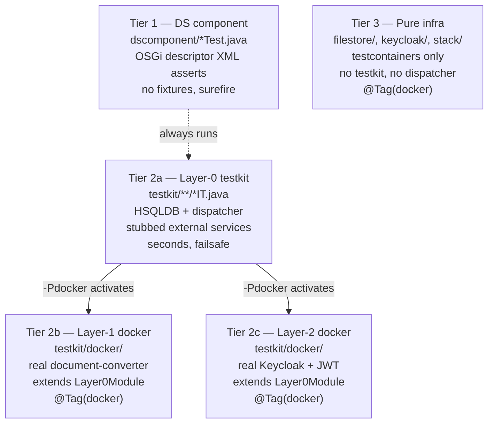

## Description

A complete in-process integration-test foundation for JUDO applications, built on `judo-runtime-core-guice-testkit` + HSQLDB. Tests run in seconds, exercise the real dispatcher (access manager, actor resolver, JQL filters, custom-op exchange functions, interceptors), and cover the full actor surface (access links + custom operations + derived attributes) without OSGi, Karaf, or testcontainers. A docker-overlay tier adds optional real-image ITs (document-converter, Keycloak / JWT) on the same base module via subclassing.

The pattern bundles eight reusable support classes, an activation-flag protocol that works around two well-known testkit-vs-runtime gaps, a Maven `surefire`/`failsafe`/`-Pdocker` profile shape, and three coverage-grid templates (access matrix, custom-op smoke, audit-window assertion).

> **Note**: This is **infrastructure**, not a model fragment. There are **no GraphQL creation mutations** — the blueprint reproduces test-module structure (`pom.xml`, support classes, IT shapes), not ESM elements. The `tests/test-blueprint-mutations.sh` validator skips it cleanly because no ` ```graphql … mutation` blocks are present.

## Tier model



| Tier | Naming | Plugin | Default | `-Pdocker` |
|---|---|---|---|---|
| 1 DS component | `*Test.java` | surefire | runs | runs |
| 2a Layer-0 testkit | `*IT.java` (no `@Tag`) | failsafe | runs | excluded |
| 2b/2c Docker overlays | `*IT.java` + `@Tag("docker")` under `testkit/docker/` | failsafe | excluded | runs |
| 3 Pure infra | `*IT.java` + `@Tag("docker")` outside `testkit/` | failsafe | excluded | runs |

## Layer files

- **[model.md](model.md)** — Maven `pom.xml` shape (failsafe wiring, surefire excludes, `-Pdocker` profile), per-tier configuration, tooling notes (`logback-test.xml`, `.sdkmanrc`, dependency pinning).
- **[backend.md](backend.md)** — The eight support classes, the activation-flag protocol, coverage-grid templates (access matrix / custom-op smoke / audit window), docker overlay templates, ten hard-won gotchas, sample IT class shapes, and verbatim source appendix.

## Examples

### compsych-letter-framework
Built the foundation as openspec change `add-testkit-integration-coverage` — six phases over 1.5k+ LoC of test code. Coverage: 1 BootIT + 12 access-link matrix ITs (3×6 grid each) + 9 custom-op ITs + 3 derived-attribute ITs + 5 docker overlay ITs (Layer-1 document-converter, Layer-2 Keycloak JWT). Discovered + worked around all 10 gotchas catalogued in `backend.md`. README and openspec proposal/design docs ship alongside the test code.

## Trade-offs

- **Pros**: tests run in seconds (no Karaf, no docker for the default suite); dispatcher path exercised end-to-end (access manager, actor resolver, JQL, custom-op exchange, interceptors); uniform helper surface (`Calls` / `Roles` / `Seed` / `AuditAssertions`) keeps each IT class focused on intent; same `Layer0Module` subclassed for docker overlays so production wiring is exercised twice (stub + real); audit-window pattern eliminates flaky timestamp assertions; 10 gotchas pre-resolved.
- **Cons**: foundation is non-trivial (~600 LoC of support code before the first IT); reflection (`FieldInjector`, registrar closure-mutation) is fragile against testkit upgrades — pin `judo-runtime-core` versions; some operations cannot be exercised without `Seed` expansion (e.g. `generate` needs a fully-templated `LetterRequest`); docker overlay tier requires explicit opt-in (`-Pdocker`) which CI must remember to flip.
- **Alternative**: Karaf-runtime ITs (slow, real OSGi DS — covers the bindings the testkit can't); pure unit tests with mocked DAOs (faster but does not exercise dispatcher / JQL / access manager).

## Related Patterns

- `integration-test-reflection-injection` — narrower precursor (this blueprint subsumes it)
- `test-data-builder-factory` — narrower precursor for the `Seed` half
- `actor-resolution-variable-resolver` — production side of what `enableActorResolution` exercises
- `audit-event-trail` — production side of what `AuditAssertions` covers
- `custom-operation-osgi-component` — production wiring for what `SdkFunctionRegistry` reproduces
