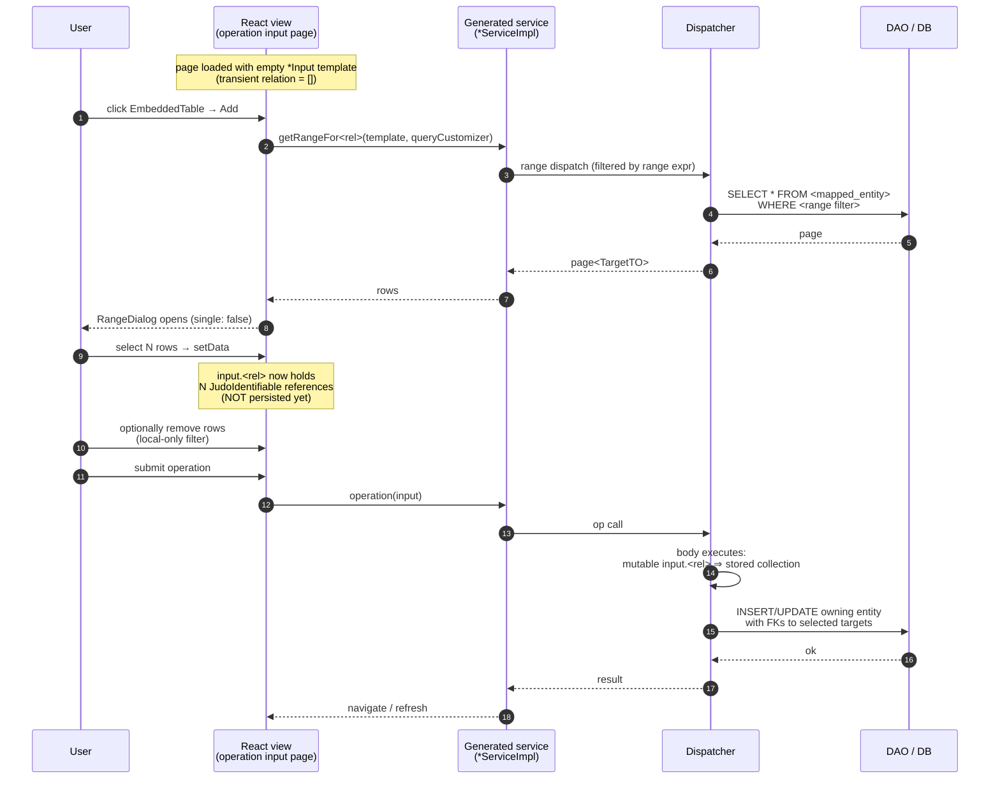

## Overview

The generated React frontend renders the transient multi-select relation as an **embedded table (or list) widget** with add / remove row affordances. Adding rows opens a `RangeDialog` in multi-select mode (`single: false`); the user can select multiple rows in one dialog interaction. Selected rows are appended to the local collection; the Remove icon removes a row from the local collection (it does not delete the underlying entity). Submitting the operation sends the collection to the backend where `mutable input.<rel>` converts it to a stored collection.

For the action-group / page-routing wrapping see [`action-group-input-output-routing`](../../best-practices/frontend/action-group-input-output-routing.md). For the single-pick variant see [`../transient-relation-single-select-input/frontend.md`](../transient-relation-single-select-input/frontend.md).

## Widget Recipe

```typescript
<EmbeddedTable
  label="Approvers"
  columns={userColumns}
  rows={data.users ?? []}
  readonly={!editMode}
  onAdd={async () => {
    const res = await openRangeDialog({
      columns: userColumns,
      rangeCall: (queryCustomizer) =>
        viewAssignApprovalServiceImpl.getRangeForUsers(data, queryCustomizer),
      single: false,
    });
    if (res && res.length) {
      const existing = data.users ?? [];
      const merged = [...existing, ...res.filter(r =>
        !existing.some(e => e.__signedIdentifier === r.__signedIdentifier)
      )];
      setData({ ...data, users: merged });
    }
  }}
  onRemoveRow={(row) =>
    setData({
      ...data,
      users: (data.users ?? []).filter(u => u.__signedIdentifier !== row.__signedIdentifier),
    })
  }
/>
```

Key bindings:
- **Service call**: `getRangeFor<rel>(template, queryCustomizer)` — same shape as the single-select variant. Returns a paginated list of mapped-TO instances filtered by the optional range expression.
- **Dialog mode**: `single: false` — the dialog returns an **array** of selected rows (or `null` on cancel).
- **Add semantics**: append selected rows, de-duplicating by `__signedIdentifier` so re-opening the dialog and re-selecting an already-added row does not produce duplicates.
- **Remove semantics**: filter the local collection; the underlying entity is untouched.
- **Submit**: `data.users` is sent as the operation input; backend body's `mutable input.users` converts it to a stored collection.

## Trade-off: unmapped target ⇒ no picker

> **Mechanical rule.** Pointing the transient relation at an **unmapped** TO yields a nested structured-input form (one sub-form per element), **not** a picker. The generator does not emit `getRangeFor<rel>()` because unmapped TOs have no persisted instance set to enumerate. If your UX requires a picker, the relation target **must** be mapped.

## Runtime Sequence



## Examples

### Alba
- **Widget**: `ApprovalTaskInput.users` rendered as an embedded table on the `assignApproval` input page.
- **Service**: `getRangeForUsers(template, queryCustomizer)` returns active TEACHER / APPROVER users (filtered by the range expression).
- **UX**: user clicks Add, selects multiple eligible users, optionally removes some, then submits to create approval tasks for each.

### ActionGroupTest
- **Widget**: `CreatureTemplate.signs` rendered as an embedded list/table on the `Planet.createCreature` input page.
- **Service**: `getRangeForSigns(template, queryCustomizer)` returns the persisted `Sign` instances.
- **UX**: user picks zero or more astrological signs; selections persist as the new creature's `signs` relation.
