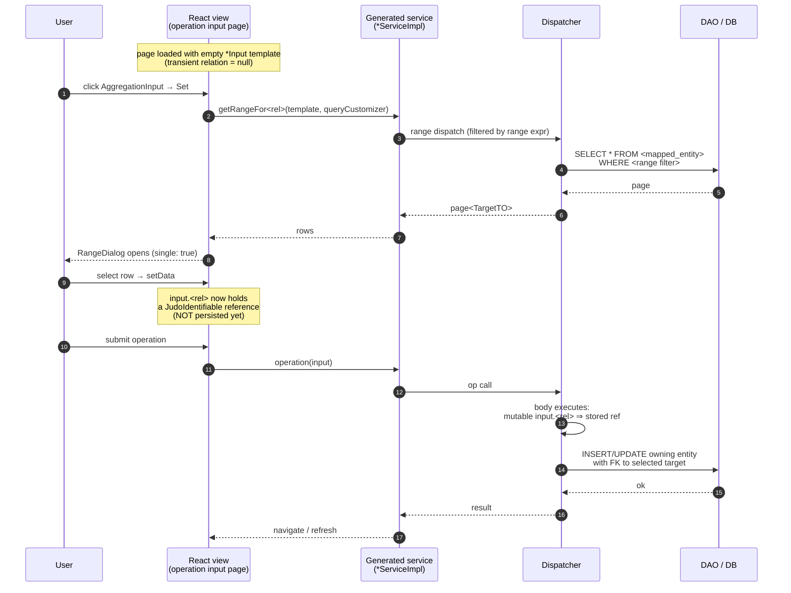

## Overview

The generated React frontend renders the transient single-select relation as an `AggregationInput` widget. The widget shows the currently selected target instance (or an empty state with a Create / Set icon), opens a `RangeDialog` in single-select mode to pick a different instance, and writes the selection back into the form's input state. Data for the dialog is fetched via the generator-emitted `getRangeFor<rel>()` service method on the operation's service implementation.

For the underlying widget itself see [`aggregation-input-widget`](../../best-practices/frontend/aggregation-input-widget.md); for the action-group / page-routing wrapping see [`action-group-input-output-routing`](../../best-practices/frontend/action-group-input-output-routing.md).

## Widget Recipe

```typescript
<AggregationInput
  label="Region"
  labelList={[data.region?.name ?? '']}
  value={data.region}
  readonly={!editMode}
  onSet={async () => {
    const res = await openRangeDialog({
      columns,
      rangeCall: (queryCustomizer) =>
        viewCreateInitiativeServiceImpl.getRangeForRegion(data, queryCustomizer),
      single: true,
    });
    if (res) setData({ ...data, region: res });
  }}
  onRemove={() => setData({ ...data, region: null })}
/>
```

Key bindings:
- **Service call**: `getRangeFor<rel>(template, queryCustomizer)` — generator emits one per transient relation with `RANGE` behavior. The first argument carries the current input template (so range expressions can reference other fields on the input); the second carries pagination / filter customizer state.
- **Dialog mode**: `single: true` — the dialog returns a single row (or null on cancel).
- **State write-back**: assign the chosen row into `data.<rel>`; on submit, `data` is sent as the operation argument and the body's `mutable input.<rel>` converts it to a stored reference.

## Runtime Sequence



## Examples

### itracker
- **Widget**: `InititativeInput.region` rendered as a single `AggregationInput` on the `createInitiative` input page.
- **Service**: `getRangeForRegion(template, queryCustomizer)` returns the paginated list of `Region` instances (filtered by the optional range expression).
- **UX**: user clicks the field's Set icon, picks a region, the dialog closes, and `data.region` is populated. On submit, the new `Initiative` is created with the selected region linked via `mutable input.region`.
